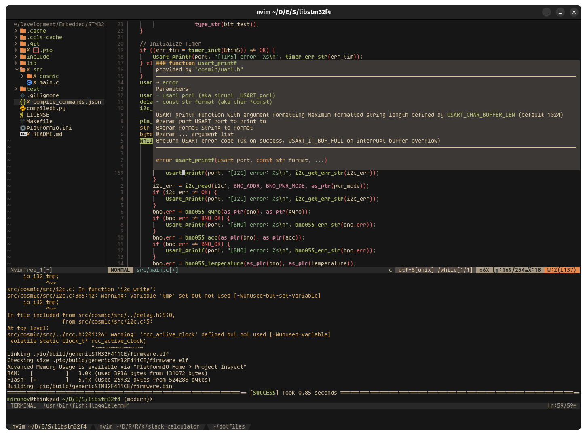
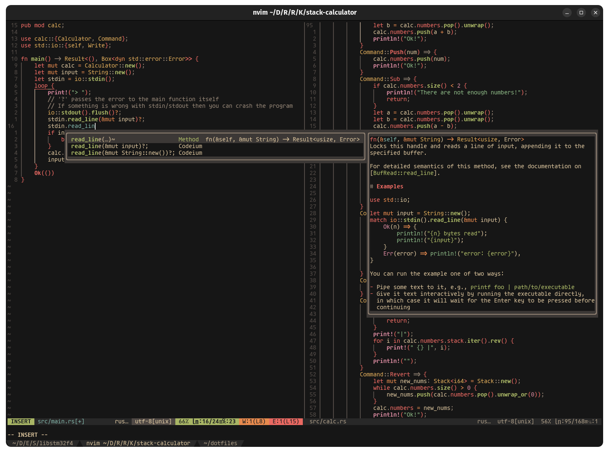

<p align="center">

```ocaml
SIMPLE / FUNCTIONAL / EASY TO USE
```

```css
     _       _    __ _ _           
    | |     | |  / _(_) |          
  __| | ___ | |_| |_ _| | ___  ___ 
 / _  |/ _ \| __|  _| | |/ _ \/ __|
 |(_| | (_) | |_| | | | |  __/\__ \ 
 \__,_|\___/\___|_| |_|_|\___||___/
                     by moonraccoon

```
</p>

## Preview
### NeoVim


### Kitty
<div align="center">
    
</div>

## Installation
For now only Debian based Linux Distributions work. Need to implement and test the script to install all the dependencies based on the used Distribution.
This will be added later.  
You first need to have `git` installed. So install `git` with:  
```bash
sudo apt-get install git
```
Once `git` is installed clone the repository with  
```bash
git clone https://github.com/moonxraccoon/dotfiles
```
and enter the folder
```bash
cd dotfiles
```
Now you can just run  
```bash
./install.sh
```
and follow the instructions. You have the option to build and install Neovim from the master branch if you don't have `nvim[>=v0.7.0]` installed.  
This will install **Packer** as the plugin manager for nvim and also install all the plugins which I have active at the moment.  
Once the `nvim` install an configuration finishes, you can find the config files in `~/.config/nvim`. The folder structure is 
explained below.

## Software Used
- neovim as my main Code Editor/IDE
- kitty as a terminal

## NeoVim config and keybinds
The config is strucured like so:
```
nvim
|____ lua
|     |____ config          <= Folder for specific setup of plugins
|     |____ mappings.lua    <= Keybind config is here (obviously)
|     |____ plugins.lua     <= The packer.nvim plugin list
|     |____ settings.lua    <= NeoVim settings
|     |____ utils.lua       <= Utility function
|____ init.lua              <= inital configuration and theme selection
```

### Plugins
**TODO**
> [!IMPORTANT]
> You need to run `:LazyUpdate` periodically to update all the plugins to the latest version.

### Adding an LSP for autocompletion:
To install autocompletion for a specific filetype you just need to use `:Mason` and install it.
The following LSP Server's are already preinstalled:  
- `pyright` (Python)
- `clangd` (C/C++)
- `tsserver` (Typescript)

### General Keybinds:
`Ctrl + h/j/k/l`: Change window focus to left/beneath/above/right window  
`Ctrl + /`: Open/Close floating terminal  
`fe`: Open/Close the file explorer on the left  
`ff`: Open the fuzzy finder to find files faster  
`FF`: Search for already open buffers  
`tn`: Create a new, empty tab  
`tc`: Close the current tab, if it is not empty  
`tl`: Move to the next tab  
`th`: Move to the previous tab  
`tf`: Go to the first tab  
`fm`: Format the file you are in (Also formats on saving file)
`K`: Hover definition of function, variable, etc.
When in Autocompletion:  
`Tab`: Go to next autocomplete suggestion  
`Shift + Tab`: Go to previous autocomplete suggestion
`Return`: Use the selected autocompletion  
`Ctrl + b/f`: Scroll through the documentation  

More keybinds will be added once I discover some new shortcuts for something.  

### TODO
- [ ] Add Golang to [`install.sh`](./install.sh)
- [ ] Add `zoxide` to [`install.sh`](./install.sh)
- [ ] Add `git config` for username and mail to [`install.sh`](./install.sh)

### Credits
- **FiraCode Nerd Font**: [GitHub](https://github.com/ryanoasis/nerd-fonts)
